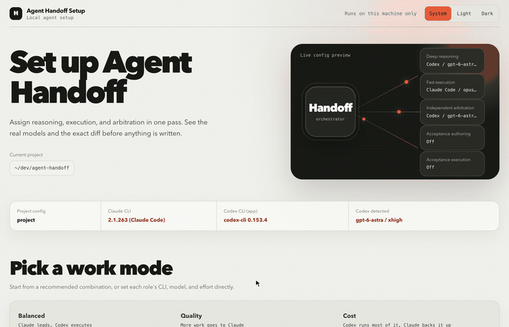
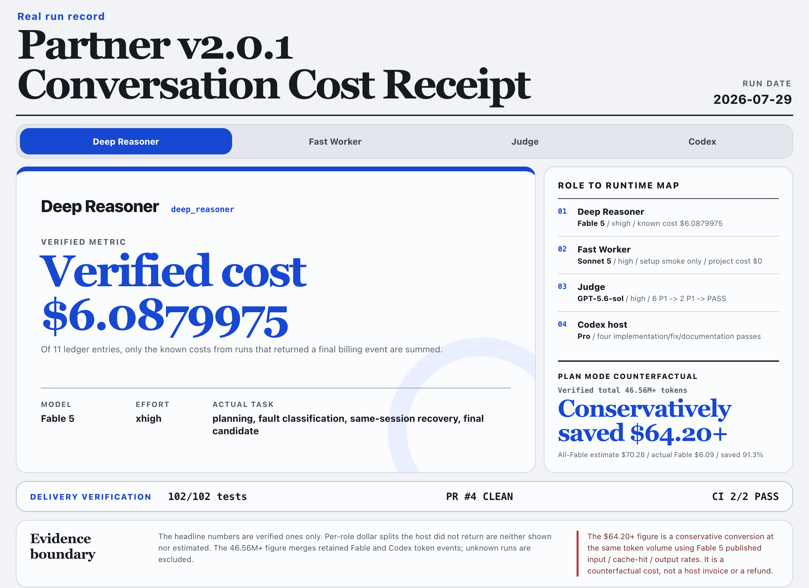

<div align="center">

# Agent Handoff

> Claude Code decides, Codex executes — every handoff leaves a receipt.

[](SKILL.md)
[](CHANGELOG.md)
[](https://github.com/kevinlin/agent-handoff/stargazers)
[](LICENSE)

**Claude Code plans, splits, and signs off. A worker CLI does the work as a background job — Codex on its own subscription, or a second Claude Code. What you save is the driver's quota and its context window; what you keep is the quality gate.**

[Install](#install) · [Showcase](#showcase) · [Use It](#use-it) · [Cost Pressure Model](#cost-pressure-model) · [What It Solves](#what-it-solves) · [Safety](#safety) · [Verify](#verify)

</div>

---

## Install

One-line install with `npx`:

```bash
npx skills add kevinlin/agent-handoff -g
```

Or ask your agent to install from GitHub:

```text
Please install Agent Handoff: https://github.com/kevinlin/agent-handoff
```

Manual local install:

```bash
git clone https://github.com/kevinlin/agent-handoff.git
cd agent-handoff
bash install.sh
```

Before first real use, say `/agent-handoff config`. Handoff opens a local single-page UI bound only to `127.0.0.1`: balanced/quality/cost starting points plus every identity's concrete CLI/model/effort are handled in one place. The beginner flow fixes project scope, local Git exclusion, and post-install checks to safe defaults instead of asking advanced questions. The page shows the exact diff before confirmation. Codex models and per-model efforts come from the local CLI `model/list`; Claude aliases and efforts come from `claude --help`. Neither side is guessed.

<div align="center">
<p><strong>Configuration demo: switch operating mode, CLI, model, and reasoning effort</strong></p>
<a href="assets/config-switch-demo.mp4">

</a>
<p><a href="assets/config-switch-demo.mp4">Open the complete 7-second MP4</a></p>
</div>

## Showcase

**A real cost receipt (v2.0.1 archive)**

<div align="center">
<a href="examples/v2.0.1-conversation-cost-receipt.html">

</a>
<p><sub>Real webpage screenshot: switch roles to inspect the actual model, effort, task, cost, and delivery evidence.</sub></p>
</div>

This is an archived fault chain from the v2.0.1 bounded planner. That component was removed in 3.0.0; the record stays because what it demonstrates still holds: real cost can be verified run by run, the failed attempt never triggered a silent model swap, and partial output was never turned into a plan.

| Observed stage | Outcome | Cost returned by Claude CLI | Handoff response |
|---|---|---:|---|
| v2.0.0 repository plan | Authentication worked; after spawning three subagents the stream idled, with no plan returned | `$6.57` | Exposed the unbounded legacy path |
| v2.0.1 fresh bounded attempt | No accepted event for 180 seconds; `idle_timeout`; no plan created | `unknown` (no final cost event) | Terminated the process group and kept metadata/checkpoint/recovery |
| Same-session resume | Exact `claude-fable-5` / `xhigh`; valid eight-section plan | `$0.382695` | Proved recovery without changing models |
| Final fresh candidate | Exact model/session, return code 0, matching packet/runner hashes | `$0.45282` | Became the final Judge and PR evidence |

These dollar values are costs returned by Claude CLI for the individual real planning runs, not a measured end-to-end token-savings rate. When a failed attempt has no final result event, the cost stays `unknown`. The [v2.0.0 failure-baseline receipt](examples/v2.0.0-conversation-cost-receipt.md) and [v2.0.1 complete conversation cost receipt](examples/v2.0.1-conversation-cost-receipt.md) record each identity's actual tasks, model, effort, and per-run cost (both are schema v2 archives). See [`docs/releases/v2.0.1.md`](docs/releases/v2.0.1.md) and [`docs/showcase-cost-model.md`](docs/showcase-cost-model.md) for the evidence boundary.

## Use It

```text
Agent handoff: plan and split this request. Send the mechanical parts to Codex as
background jobs, watch them, then read the complete diff yourself before
accepting. End with a Handoff Session Receipt.
```

Short version:

```text
Hand the mechanical parts off to Codex in the background, then full-review.
```

First run, set it up:

```text
/agent-handoff config
```

Or open it directly from the repository:

```bash
bash install.sh --config --repo /path/to/project
```

## Cost Pressure Model

Handoff's savings do not come from using Claude less. They come from not spending the Claude meter on mechanical work. The expensive waste is having Claude walk a batch migration file by file, write boilerplate tests, or run a wide read-only scan — move that to the Codex subscription and the quality of judgment is unchanged.

This README uses a showcase workload model, not API billing telemetry. Without reliable token logs, Handoff does not invent token-savings numbers. The table is generated by `scripts/showcase-cost-ledger.py`; the source ledger is `examples/showcase-cost-ledger.json`.

| Without Handoff | With Handoff |
|---|---|
| Mechanical edits bill the Claude API meter | Mechanical edits land on whichever backend the identity names — the Codex subscription by default |
| Execution history fills the driver's context | It stays in the job directory; the driver reads a result |
| "I delegated it" is just a claim | Every task has a jobId, with the real backend/model/effort in its meta |
| Token savings stay hand-wavy | The receipt says `codex_jobs`, `cc_jobs`, and `roles_used` |

Three operating modes:

| Mode | Codex carries | Claude Code carries | Claude pressure | Best for |
|---|---:|---:|---:|---|
| Codex-only | 100% implementation and checks | 0% | 0.0x, but no independent sign-off | Low-risk tasks you can verify yourself |
| Handoff | ~70% implementation, checks, fixes | ~30% planning, splitting, full review | 0.3x | Many tasks, heavy mechanical volume, Claude API cost matters |
| Pure Claude Code | 0% | 100% full workflow | 1.0x, including mechanical edits | Tiny tasks or when the user explicitly wants Claude to do everything |

Receipt example:

```text
[Handoff session receipt]
phase: final fix
claude_session: 9836fe7e-4aca-47a6-83b5-69086b8db275
duration: 74min 12sec
codex_jobs: 2
codex_job_durations: job-t1=18min 12sec; job-t1-r2=6min 05sec
cc_jobs: 1
cc_job_durations: job-t2=9min 30sec
checks: bash scripts/check-skill-repo.sh .; jq schema check; git diff --check
anomalies: none
scope: project
config_source: project
roles_used: [{"role":"fast_worker","host":"codex","model":"gpt-fast","effort":"high","verified":true}]
receipt_schema_version: 5
```

When exact token telemetry is unavailable, Handoff reports verifiable behavior: which work ran on which backend, how many jobs and fix rounds, that the full diff was read against the acceptance criteria, and that the checks passed.

## What It Solves

You may already switch between Codex and Claude Code. The issue is not whether they can collaborate — it's that the workflow breaks down in practice:

- Claude Code is valuable for planning, judgment, and sign-off, but expensive for every mechanical edit.
- Codex is strong at implementation, long-context fixes, and batch migrations, but lacks an independent reviewer.
- "Delegate it to Codex" is usually just a claim: no job state, no record of the real model and effort, and nobody comes back to read the diff against the acceptance criteria.
- Users hear "I delegated it" but cannot see where the saving came from or whether quality slipped.

Handoff turns this into a protocol:

```text
Claude Code (driver):
  plan -> split (adversarial gate) -> delegate -> monitor loop -> full review -> receipt

Codex (background jobs):
  implement -> report -> bounded fix rounds on the same session
```

One channel carries delegated work: the Handoff background job (`delegate-codex.sh --role <identity>`, with durable state, loop monitoring, and resume rework). It runs on whichever CLI the identity's `backend` names — Codex, or a second Claude Code — and everything about the job is identical either way. In-process subagents are the two escape hatches, for a stuck-step assist or work no identity fits. Quality-critical steps stay in the driving session even though it is the expensive seat.

Routing is never re-decided per run. Moving a task onto a different vendor is a config change you can see, not a swap to whichever identity happens to be cheaper — `delegate-codex.sh` refuses a per-job `--backend` that contradicts the identity's configuration.

Every split passes an adversarial gate first, answering three questions in writing: does this task really not need the expensive tier, will the integration cost of the boundary eat the saving, and does each row's identity match its actual stakes. A row that fails any of them gets its identity corrected, merged into a neighbour, or kept in Claude's hands.

Role model/effort has exactly one source of truth, `.handoff/config.toml` (project or global) — it does not get copy-pasted into prompts or docs.

## Trigger Prompts

```text
agent handoff
Agent handoff: help me plan this task.
Hand the mechanical parts off to Codex in the background, then full-review.
Hand part of this refactor to Codex — check whether the split holds up first.
The Codex jobs finished; sign them off and give me the receipt.
/agent-handoff resume the last task from .handoff/ state.
/agent-handoff config
/agent-handoff tryout
Run the full handoff protocol and deliver a PR.
This conclusion is contested — have the arbiter blind-solve it before we decide.
```

## What It Delivers

- Clear routing: Claude Code plans, splits, integrates, and signs off; the delegated worker implements, runs checks, handles batch work, and reworks.
- An adversarial split gate: every row answers three questions before it may go down a tier; a row that fails gets a corrected identity or stays with Claude.
- Durable background jobs on either backend: `scripts/delegate-codex.sh` wraps `codex exec --json` and `claude --print --output-format stream-json` as jobs you can status, resume, and cancel, with state under `<repo>/.handoff/jobs/`. One code path, one job shape, one lifecycle test run against both.
- A full-review gate: the complete diff is read against the acceptance criteria in `.handoff/goal.md` — not a sample, and not Codex's own summary. At most two fix rounds per task, then the task comes back to Claude.
- A Session Receipt: `duration` (wall clock, permission waits included), `codex_jobs` and `cc_jobs` with their per-job durations, checks, anomalies, and `roles_used` — machine-checkable via `scripts/validate-receipt.py`.
- A concurrency-safe goal file: `scripts/goal-sync.py` reads and writes `.handoff/goal.md` behind a sha256 check, so the monitor loop and the driver never silently clobber each other.
- Blind arbitration: a contested call goes to `deep_reasoner` and `arbiter` at once, neither seeing the other's answer; the driver rules on disagreement and records it in the receipt.
- An optional second pair of eyes on the plan (`--spec-review`): before a plan reaches you, `deep_reasoner` reads it once on its own model and reports what it would change. Read-only, once per run, and the driver still rules — it closes the gap where the agent that wrote the plan is the only one that judged it.
- Five identities, each a `backend + model + effort` triple pinned independently. `backend` decides which CLI executes that identity's jobs, and both values are first-class delegation channels:

  | identity | carries | |
  |---|---|---|
  | `deep_reasoner` | architecture, ambiguous requirements, root-cause diagnosis, and the optional one-shot review of the plan | core |
  | `fast_worker` | mechanical, spec-complete implementation and checks | core |
  | `arbiter` | blind second solve for contested calls | core |
  | `e2e_specifier` | Gherkin scenarios plus repo-native executable acceptance tests | optional |
  | `e2e_verifier` | runs the reviewed tests, returns a validated PASS/FAIL/BLOCKED verdict | optional |

  The optional pair is written only when setup runs `--with-e2e`; a three-identity config is complete. See [`references/e2e-gauntlet.md`](references/e2e-gauntlet.md). `deep_reasoner` carries one further toggle, `--spec-review`, also off by default.
- A Darwin-style ratchet: improve one workflow dimension at a time and keep only verified gains.
- A first-run setup wizard (`/agent-handoff config`): balanced/quality/cost presets remain editable per identity; `.handoff/config.toml` is the single source of truth; beginner-safe defaults remove advanced setup questions; the exact diff is previewed before writing; models and efforts come from each CLI's real capability list; post-install verification uses a tool-free fresh Claude session plus the Codex delegate dry-run chain.
- Handoff Session Receipt v5: `scope`/`config_source`/`roles_used` prove which backend, model, and effort actually ran a role, not just "it was delegated," and the two job counts are partitioned by the CLI that executed them.
- An opt-in full protocol (`references/goal-to-pr.md`): Plan→Goal→PR→Verification, running unattended up through merge-ready + preview verified; merge, production, tags, force-push, deletion, destructive migration, and external publish each still need their own explicit imperative.

## File Map

```text
SKILL.md                                Runtime instructions for Claude Code
README.md                               Project entrypoint
install.sh                              Local installer for ~/.claude/skills/agent-handoff
test-prompts.json                       Trigger and behavior regression prompts
docs/showcase-cost-model.md             Showcase cost-pressure model and real token capture fields
docs/receipt-schema.json                JSON schema for the Handoff Session Receipt (handoff.receipt.v5)
docs/config-schema.md                   Handoff config schema v2: identity matrix, precedence, concurrency, TOML subset
docs/verdict-schema.json                JSON schema for the e2e verdict artifact (handoff.verdict.v1)
examples/session-receipt.md             Receipt example (schema v5, validated in CI)
examples/v2.0.0-conversation-cost-receipt.md
                                        Identity, model, effort, and cost receipt for the v2.0.0 failure baseline
examples/v2.0.1-conversation-cost-receipt.md
                                        Real task, model, effort, and cost receipt for the three core identities
examples/showcase-cost-ledger.json      Cost-pressure ledger for the three operating modes
references/handoff-template.md          Delegation packet, spec review packet, and user-facing Goal Packet templates
references/darwin-ratchet.md            Validation-gated improvement rules
references/e2e-gauntlet.md              Optional e2e acceptance roles: worktree protocol, both packets, verdict contract
references/claude-driven.md             The five-phase flow (adversarial split gate and blind arbitration included)
references/setup.md                     `/agent-handoff config` first-run setup wizard: identity matrix (cross-vendor identities)
references/tryout.md                    `/agent-handoff tryout` identity tryout: one micro-task per identity, report proving the models are live
references/goal-to-pr.md                Opt-in full protocol: Plan→Goal→PR→Verification, hard-stop list, imperative authorization
references/goal-template.md             Template for .handoff/goal.md (task table + checkpoint rule)
references/fable5-principles.md         Shared frontier-model prompting rules (why-forward, effort, checkpoint, resume)
references/memory-protocol.md           Wrap-up memory protocol (claude-mem / mem0 / auto-memory / rollout)
scripts/showcase-cost-ledger.py         Rebuilds the showcase cost-pressure ledger
scripts/check-skill-repo.sh             Publish readiness smoke check
scripts/english-only-scan.py            Fails if any tracked file contains CJK text
scripts/make-receipt.py                 Generates a pre-validated receipt, can persist to .handoff/
scripts/validate-receipt.py             Validates Handoff Session Receipt fields and values
scripts/validate-verdict.py             Validates an e2e verdict artifact, including its cross-field rules
scripts/run-test-prompts.py             Static validation of the regression prompts
scripts/delegate-codex.sh               Background-job primitive for both backends: submit / status / result / resume / cancel / cleanup
scripts/handoff-config.py               Config engine: TOML-subset parsing, deterministic writes, locking (schema v2)
scripts/handoff_runtime.py              Shared Claude child-process environment boundary for first-party OAuth
scripts/handoff-setup.py                Setup wizard engine: --preview/--apply/--rollback/--smoke/--status/--interactive
scripts/handoff-setup-ui.py             Localhost single-page setup UI: full model matrix, exact preview, confirmed apply
scripts/goal-sync.py                    Hash-checked .handoff/goal.md read/write: concurrent writes abort instead of silently losing updates
tests/test_handoff_config.py            Config engine unit tests (round-trip / lock / precedence chain)
tests/test_handoff_setup.py             Setup engine unit tests (idempotence / overwrite refusal / managed block / rollback)
tests/test_handoff_setup_ui.py          Local UI state, preview binding, and write-gate unit tests
tests/test_delegate_role.py             Unit tests for --role injection, the override chain, and backend parity
tests/test_goal_sync.py                 goal.md concurrency unit tests (stale-hash writes rejected, no silent lost update)
```

## Safety

- Background jobs use the read-write sandbox from your own codex config, or `--permission-mode acceptEdits` on a claude worker (`HANDOFF_CLAUDE_PERMISSION_MODE` overrides it); pass `--read-only` for scan and review jobs on either.
- Delegating is not handing over control: architecture, the split decision, cross-task integration, security- and correctness-critical paths, and final acceptance all stay with the driving session.
- Never accept a diff you have not read, and never mark a task done because a worker said it finished.
- Do not change repo visibility, tag releases, publish to registries, or announce externally without explicit permission.
- Do not use `git reset --hard` as the default rollback path. Prefer reviewable diffs or reverts.
- `.handoff/config.toml` is not tracked by Git by default (added to `.git/info/exclude`, your `.gitignore` is untouched); the Codex side never invents a model name — detection failure is a clear error, waiting for you.
- The managed routing block (the persistent routing section it can write into CLAUDE.md) is off by default; all five ways its markers can be corrupted are refused with an explanation, never guessed at.
- The full protocol (Plan→Goal→PR→Verification) is no exception: merge, production, tags, force-push, deletion, destructive migration, and external publish each need their own explicit imperative — an earlier "continue" never covers them.

## Verify

```bash
bash scripts/check-skill-repo.sh .
python3 -m unittest discover tests
jq -r '.[].id' test-prompts.json
SOURCE_DATE_EPOCH=1782921600 python3 scripts/showcase-cost-ledger.py
```

These checks also run automatically on every push and pull request via GitHub Actions (`.github/workflows/checks.yml`).

## License

MIT

---

<div align="center">

<sub>Forked from **[LearnPrompt/partner-skill](https://github.com/LearnPrompt/partner-skill)** — MIT.</sub>

<sub>Acknowledgment: the done_when / anti-Goodhart / imperative-authorization vocabulary in `references/goal-to-pr.md` draws on [loop-engineering](https://github.com/LearnPrompt/loop-engineering)'s goal-forging.md and guardrails.md (vocabulary and invariants only — not its YAML format or ceremony).</sub>

</div>
