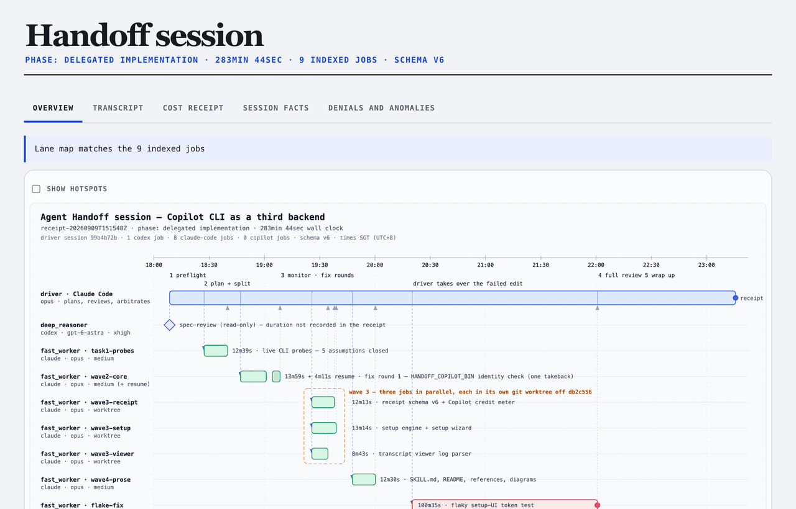
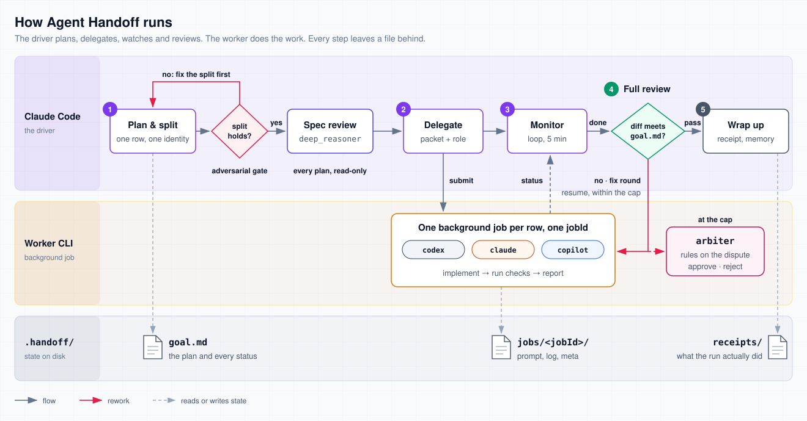

<div align="center">

# Agent Handoff

> Claude Code decides, a worker CLI executes — every handoff leaves a receipt.

[](SKILL.md)
[](CHANGELOG.md)
[](https://github.com/kevinlin/agent-handoff/stargazers)
[](LICENSE)

**Claude Code plans, splits, and signs off. A worker CLI does the work as a background job — Codex on its own subscription, a second Claude Code, or GitHub Copilot on its AI credits. What you save is the driver's quota and its context window; what you keep is the quality gate.**

[Install](#install) · [Showcase](#showcase) · [Use It](#use-it) · [How The Flow Runs](#how-the-flow-runs) · [User Guide](docs/user-guide/agent-handoff.html) · [Cost Pressure Model](#cost-pressure-model) · [What It Solves](#what-it-solves) · [Safety](#safety) · [Verify](#verify)

</div>

---

## Install

One-line install with `npx`:

```bash
npx skills add kevinlin/agent-handoff -g
```

Or ask your agent to install from GitHub:

```text
Please install Agent Handoff: https://github.com/kevinlin/agent-handoff
```

Manual local install:

```bash
git clone https://github.com/kevinlin/agent-handoff.git
cd agent-handoff
bash install.sh
```

Before first real use, say `/agent-handoff config`. Handoff opens a local single-page UI bound only to `127.0.0.1`: balanced/quality/cost starting points plus every identity's concrete CLI/model/effort are handled in one place. The beginner flow fixes project scope, local Git exclusion, and post-install checks to safe defaults instead of asking advanced questions. The page shows the exact diff before confirmation. Codex models and per-model efforts come from the local CLI `model/list`; Claude aliases and efforts come from `claude --help`. Copilot publishes no model catalog, so you type its model name and the CLI checks the model-and-effort pair when you install. Nothing is guessed.

<div align="center">
<p><strong>Configuration demo: switch operating mode, CLI, model, and reasoning effort</strong></p>
<a href="assets/config-switch-demo.mp4">

</a>
<p><a href="assets/config-switch-demo.mp4">Open the full-resolution MP4</a> — one pass through the page: work mode, each role's CLI, model and effort, the two optional add-ons, then the exact diff.</p>
</div>

## Showcase

**A whole run, replayed on one page (v3.7.2)**

<div align="center">

<p><sub>Recorded from <code>/agent-handoff visualise</code> on a real receipt: the run that added Copilot as a third backend, 283 minutes, nine delegated jobs.</sub></p>
</div>

The overview draws the run as a timeline, one lane per job. **Show hotspots** outlines each clickable region so you can check it sits on its bar. Clicking the red flake-fix lane opens that job's transcript. It was the one job that failed, cut off by a Claude session limit mid-edit, and the driver verified its partial change itself. The Cost receipt tab is the same page `/agent-handoff cost-receipt` writes: token counters from each job's log, plus the CLI's own cost for the Claude-backed jobs. Session facts and Denials and anomalies come straight from the receipt and the job state files.

Nothing checks the timeline's labels; they were written when the diagram was generated. Every other tab is read from files on disk.

## Use It

```text
Agent handoff: plan and split this request. Send the mechanical parts to Codex as
background jobs, watch them, then read the complete diff yourself before
accepting. End with a Handoff Session Receipt.
```

Short version:

```text
Hand the mechanical parts off to Codex in the background, then full-review.
```

First run, set it up:

```text
/agent-handoff config
```

Or open it directly from the repository:

```bash
bash install.sh --config --repo /path/to/project
```

Review a finished run on one page:

```text
/agent-handoff visualise
/agent-handoff visualise .handoff/receipts/receipt-20260909T151548Z.md
Show me the session timeline of the last run.
```

With no receipt named, it opens the newest one under `.handoff/receipts/`. To start the viewer yourself, print its URL, and stop it with Ctrl-C:

```bash
python3 ~/.claude/skills/agent-handoff/scripts/handoff-session-ui.py --repo /path/to/project --no-open
```

## How The Flow Runs

<div align="center">
<a href="docs/user-guide/diagrams/handoff-lifecycle.svg">

</a>
</div>

Claude Code drives five steps. It plans the work and splits it into one row per identity, then attacks its own split: a row that fails the gate is fixed before anything leaves the driver. Each surviving row goes to a worker CLI as a background job with its own jobId. The backend (Codex, a second Claude Code, or Copilot) comes from the identity's config, and the job looks the same on all three. The driver checks the job's status on disk instead of holding its history in context. When the job finishes, the driver reads the whole diff against `.handoff/goal.md`. A diff that fails goes back to the same worker session as a fix round, within the review cap (three passes by default); if findings are still open after the last pass, the arbiter rules on the dispute. A diff that passes goes to wrap up, which writes the session receipt.

Each phase has its own diagram in [`docs/user-guide/diagrams/`](docs/user-guide/diagrams/): the [plan and split gate](docs/user-guide/diagrams/phase1-plan-split.svg), [delegation](docs/user-guide/diagrams/phase2-delegate.svg), [the monitor loop](docs/user-guide/diagrams/phase3-monitor.svg), [the review gate](docs/user-guide/diagrams/phase4-review-gate.svg), and [wrap up](docs/user-guide/diagrams/phase5-wrap-up.svg), plus [packet anatomy](docs/user-guide/diagrams/handoff-packet-anatomy.svg), [the evidence ladder](docs/user-guide/diagrams/context-ladder.svg), and [the goal-drift loop](docs/user-guide/diagrams/feedback-loop.svg). The prose they illustrate is [`references/claude-driven.md`](references/claude-driven.md).

For the walkthrough of all five stages — what crosses each boundary, what is enforced there, and what evidence survives — read the [user guide](docs/user-guide/agent-handoff.html).

## Cost Pressure Model

Handoff's savings do not come from using Claude less. They come from not spending the Claude meter on mechanical work. The expensive waste is having Claude walk a batch migration file by file, write boilerplate tests, or run a wide read-only scan — move that to the Codex subscription and the quality of judgment is unchanged.

This README uses a showcase workload model, not API billing telemetry. Without reliable token logs, Handoff does not invent token-savings numbers. The table is generated by `scripts/showcase-cost-ledger.py`; the source ledger is `examples/showcase-cost-ledger.json`.

| Without Handoff | With Handoff |
|---|---|
| Mechanical edits bill the Claude API meter | Mechanical edits land on whichever backend the identity names — the Codex subscription by default |
| Execution history fills the driver's context | It stays in the job directory; the driver reads a result |
| "I delegated it" is just a claim | Every task has a jobId, with the real backend/model/effort in its meta |
| Token savings stay hand-wavy | The receipt says `codex_jobs`, `cc_jobs`, `copilot_jobs`, and `roles_used` |

Three operating modes:

| Mode | Codex carries | Claude Code carries | Claude pressure | Best for |
|---|---:|---:|---:|---|
| Codex-only | 100% implementation and checks | 0% | 0.0x, but no independent sign-off | Low-risk tasks you can verify yourself |
| Handoff | ~70% implementation, checks, fixes | ~30% planning, splitting, full review | 0.3x | Many tasks, heavy mechanical volume, Claude API cost matters |
| Pure Claude Code | 0% | 100% full workflow | 1.0x, including mechanical edits | Tiny tasks or when the user explicitly wants Claude to do everything |

Receipt example:

```text
[Handoff session receipt]
phase: final fix
claude_session: 9836fe7e-4aca-47a6-83b5-69086b8db275
duration: 74min 12sec
codex_jobs: 2
codex_job_durations: job-t1=18min 12sec; job-t1-r2=6min 05sec
cc_jobs: 1
cc_job_durations: job-t2=9min 30sec
copilot_jobs: 1
copilot_job_durations: job-t3=4min 47sec
checks: bash scripts/check-skill-repo.sh .; jq schema check; git diff --check
anomalies: none
scope: project
config_source: project
roles_used: [{"role":"fast_worker","host":"codex","model":"gpt-fast","effort":"high","verified":true}]
receipt_schema_version: 6
```

When exact token telemetry is unavailable, Handoff reports verifiable behavior: which work ran on which backend, how many jobs and fix rounds, that the full diff was read against the acceptance criteria, and that the checks passed.

## What It Solves

You may already switch between Codex and Claude Code. The issue is not whether they can collaborate — it's that the workflow breaks down in practice:

- Claude Code is valuable for planning, judgment, and sign-off, but expensive for every mechanical edit.
- Codex is strong at implementation, long-context fixes, and batch migrations, but lacks an independent reviewer.
- "Delegate it to Codex" is usually just a claim: no job state, no record of the real model and effort, and nobody comes back to read the diff against the acceptance criteria.
- Users hear "I delegated it" but cannot see where the saving came from or whether quality slipped.

Handoff turns this into a protocol:

```text
Claude Code (driver):
  plan -> split (adversarial gate) -> delegate -> monitor loop -> full review -> receipt

Worker CLI (background jobs, on the identity's configured backend):
  implement -> report -> bounded fix rounds on the same session
```

One channel carries delegated work: the Handoff background job (`delegate-codex.sh --role <identity>`, with durable state, loop monitoring, and resume rework). It runs on whichever CLI the identity's `backend` names — Codex, a second Claude Code, or GitHub Copilot — and everything about the job is identical on all three. In-process subagents are the two escape hatches, for a stuck-step assist or work no identity fits. Quality-critical steps stay in the driving session even though it is the expensive seat.

Routing is never re-decided per run. Moving a task onto a different vendor is a config change you can see, not a swap to whichever identity happens to be cheaper — `delegate-codex.sh` refuses a per-job `--backend` that contradicts the identity's configuration.

Every split passes an adversarial gate first, answering three questions in writing: does this task really not need the expensive tier, will the integration cost of the boundary eat the saving, and does each row's identity match its actual stakes. A row that fails any of them gets its identity corrected, merged into a neighbour, or kept in Claude's hands.

Role model/effort has exactly one source of truth, `.handoff/config.toml` (project or global) — it does not get copy-pasted into prompts or docs.

## Trigger Prompts

```text
agent handoff
Agent handoff: help me plan this task.
Hand the mechanical parts off to Codex in the background, then full-review.
Hand part of this refactor to Codex — check whether the split holds up first.
The Codex jobs finished; sign them off and give me the receipt.
/agent-handoff resume the last task from .handoff/ state.
/agent-handoff config
/agent-handoff tryout
/agent-handoff transcript
Show me the transcript of that Codex job.
Run the full handoff protocol and deliver a PR.
This conclusion is contested — have the arbiter blind-solve it before we decide.
```

## What It Delivers

### The workflow

- Claude Code plans, splits, integrates, and signs off. The worker implements, runs checks, and reworks.
- Split gate: every row answers three questions in writing before it moves to a cheaper identity. A row that fails gets another identity or stays with Claude.
- Full review: the driver reads the whole diff against the acceptance criteria in `.handoff/goal.md`. A task gets three review passes by default (`implementation_max_rounds`); if findings are still open after the last one, the arbiter rules, and a rejection stops that task for you to pick up.
- Blind arbitration: on a contested call, `deep_reasoner` and `arbiter` answer without seeing each other's work. The driver rules, and the receipt records it.
- Plan review (every run): `deep_reasoner` reads the plan, read-only, before it reaches you. A blocking finding the driver declines goes to the arbiter once `spec_max_rounds` (default 1) runs out.
- Full protocol (opt-in, [`references/goal-to-pr.md`](references/goal-to-pr.md)): runs unattended from plan to a merge-ready, preview-verified PR. Merge, production, tags, force-push, deletion, destructive migrations, and external publishing each still need your explicit go-ahead.

### Jobs

- `scripts/delegate-codex.sh` runs each task as a background job on Codex (`codex exec`), Claude Code (`claude --print`), or Copilot (`copilot -p`). The job shape and lifecycle are the same on all three: submit, status, resume, cancel. State lives in `<repo>/.handoff/jobs/`.
- `scripts/goal-sync.py` guards `.handoff/goal.md` with a sha256 check, so the monitor loop and the driver can't overwrite each other.

### Evidence after the run

| Output | How to get it | What it shows |
|---|---|---|
| Session Receipt (schema v6) | Written at wrap-up; `scripts/validate-receipt.py` checks it | Wall-clock `duration`; `codex_jobs`, `cc_jobs`, `copilot_jobs` with per-job durations; checks; anomalies; `roles_used` with the backend, model, and effort that actually ran |
| Session page | `/agent-handoff visualise [<receipt-file>]` | The whole run on one loopback page: a clickable timeline, each job's transcript, the cost receipt, session facts, denials and anomalies. The timeline's prose is hand-written and unchecked; every other tab is read from disk. [Release notes](docs/releases/v3.7.2.md) |
| Job transcript | `/agent-handoff transcript` | One job's `log.jsonl` as a readable HTML page, in any of the three backends' event formats. Drop a `log.jsonl` on the page to render a job from another repo |
| Cost receipt | `/agent-handoff cost-receipt` | Measured numbers only. Codex jobs: token counters (the CLI emits no cost). Claude jobs: the CLI's own `total_cost_usd`. Copilot jobs: token counters, premium requests, and nano-AIU, which are AI credits, not money. No saving is computed. [Example](assets/v3.6.1-conversation-cost-receipt.png) |

### Configuration

Five identities, each a `backend + model + effort` triple set on its own. `backend` picks the CLI that runs that identity's jobs.

| identity | carries | |
|---|---|---|
| `deep_reasoner` | architecture, ambiguous requirements, root-cause diagnosis, review of every plan | core |
| `fast_worker` | mechanical, spec-complete implementation and checks | core |
| `arbiter` | blind second solve for contested calls; rules when a review gate runs out of rounds | core |
| `e2e_specifier` | Gherkin scenarios plus repo-native executable acceptance tests | optional |
| `e2e_verifier` | runs the reviewed tests, returns a validated PASS/FAIL/BLOCKED verdict | optional |

Setup writes the optional pair only with `--with-e2e` (see [`references/e2e-gauntlet.md`](references/e2e-gauntlet.md)). All values live in `.handoff/config.toml`, project or global, and nowhere else.

- `/agent-handoff config` opens the setup wizard: balanced, quality, or cost presets, editable per identity. It shows the exact diff before writing. Models and efforts come from each CLI's own list, except Copilot's model, which you type because Copilot publishes no catalog. After install it smoke-tests each configured backend.
- Darwin ratchet ([`references/darwin-ratchet.md`](references/darwin-ratchet.md)): change the workflow one dimension at a time, and keep a change only when repo evidence improves.

## Safety

- Each identity selects `permission_mode=default|allow-all`. Default uses Claude `dontAsk` with `Read Glob Grep Edit Write Bash`, inherited Codex config without sandbox flags, or Copilot `--allow-all-tools` retaining path/URL checks. Allow-all means *use the provider's native unrestricted mode*, not force three CLIs into one security posture. Only claude changes behaviour under default; Codex and Copilot retain their previous flags. Read-only wins over the retained Claude env override and configured posture; the env value is still validated first. Read-only drops Claude's worker allowlist and Copilot's allow-all flags. Resume inherits posture and read_only; missing parent posture means default, never allow-all. Warnings follow the effective concrete mode. No OS-level sandbox is added for Claude default. Codex denials are not counted, and permission_denied is advisory, not enforced. Verify edits and checks on disk. See [the schema](docs/config-schema.md#permission-posture-v371) for mappings and research deviations.
- Delegating is not handing over control: architecture, the split decision, cross-task integration, security- and correctness-critical paths, and final acceptance all stay with the driving session.
- Never accept a diff you have not read, and never mark a task done because a worker said it finished.
- Do not change repo visibility, tag releases, publish to registries, or announce externally without explicit permission.
- Do not use `git reset --hard` as the default rollback path. Prefer reviewable diffs or reverts.
- `.handoff/config.toml` is not tracked by Git by default (added to `.git/info/exclude`, your `.gitignore` is untouched); no backend ever invents a model name — a detection failure, or a model Copilot refuses, is a clear error waiting for you.
- The managed routing block (the persistent routing section it can write into CLAUDE.md) is off by default; all five ways its markers can be corrupted are refused with an explanation, never guessed at.
- The full protocol (Plan→Goal→PR→Verification) is no exception: merge, production, tags, force-push, deletion, destructive migration, and external publish each need their own explicit imperative — an earlier "continue" never covers them.

## Verify

```bash
bash scripts/check-skill-repo.sh .
python3 -m unittest discover tests
jq -r '.[].id' test-prompts.json
SOURCE_DATE_EPOCH=1782921600 python3 scripts/showcase-cost-ledger.py
```

These checks also run automatically on every push and pull request via GitHub Actions (`.github/workflows/checks.yml`).

## License

MIT

---

<div align="center">

<sub>Forked from **[LearnPrompt/partner-skill](https://github.com/LearnPrompt/partner-skill)** — MIT.</sub>

<sub>Acknowledgment: the done_when / anti-Goodhart / imperative-authorization vocabulary in `references/goal-to-pr.md` draws on [loop-engineering](https://github.com/LearnPrompt/loop-engineering)'s goal-forging.md and guardrails.md (vocabulary and invariants only — not its YAML format or ceremony).</sub>

</div>
